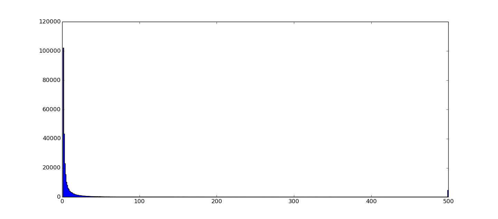
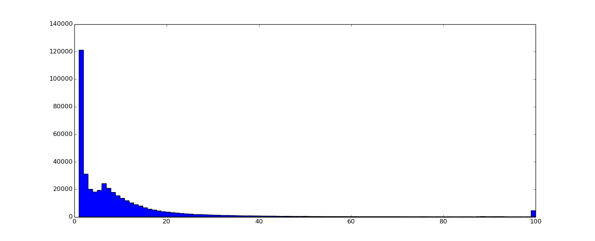

###About the data format

Two ways have been considered to handle the data:

* Use MongoDB: this was the first attempt, the neighbor-based module uses this approach. Since the unprocessed data consists in a lot of JSON files MongoDB seemed appropriate. However we don't really want to query the dataset, we only want to stream it through our pipeline. 

* Preprocess the data and save everything in a compact JSON file: removing the unnecessary attributes, avoiding redundancies as well as removing playlists that are too short to contain relevant information allows to generate a new dataset. This dataset (around 600Mb) can be loaded in main memory. This dataset is used by the model-based approach.  

###Some stats

The artist popularity is the number of playlists in which the artist is referenced:

Histogram of the number of unique artists per playlist:

First observation that is not really a surprise, a huge part of the playlists contain one artist only. This means that many playlists will have to be dropped later on. The second observation is that many artists are referenced less than 50 times in the whole corpus!!! 

Since grooveshark allows its users to upload content there are a lot of duplicates, the dataset is extremely noisy. To remove some of the noise we filter all the artists with a popularity inferior to a certain threshold. Doing so leaves us with a much smaller dataset than the original one. It also remove the precious correlations from the dataset. 